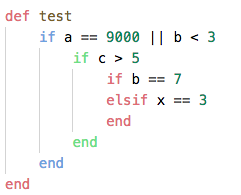
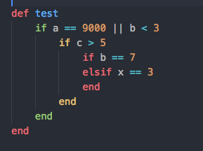
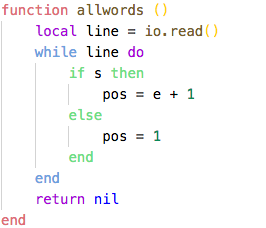
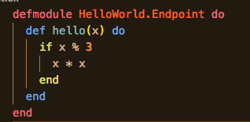
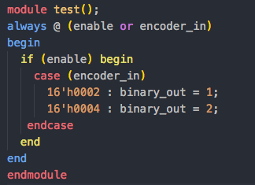
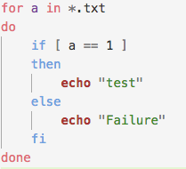
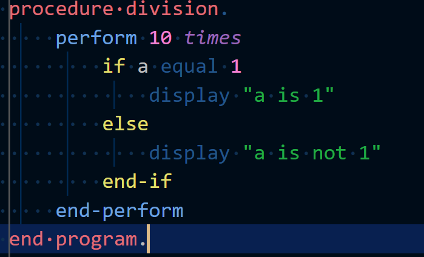
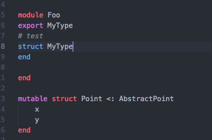

# Rainbow End

[](https://marketplace.visualstudio.com/items?itemName=jduponchelle.rainbow-end) [](https://marketplace.visualstudio.com/items?itemName=jduponchelle.rainbow-end)

This extension allows to identify keyword / end with colours.

## Languages supported

* Ruby
* Lua
* Elixir
* Crystal
* Shell
* Verilog
* COBOL
* Julia

## Screenshots

## Ruby





## Lua



## Elixir



## Crystal


## Verilog



## Shell



## COBOL



## Julia




## Robot Framework

We have support for the Robot Framework

## Colors customization

You can override the color by putting in your `settings.json`:

```json
{
    "workbench.colorCustomizations": {
        "rainbowend.deep1": "#e06c75",
        "rainbowend.deep2": "#6ca2e0",
        "rainbowend.deep3": "#e0de6c"
    }
}
```

## Add new language

You can open an issue with sample code for the language you want to have.

Or you can contribute it by adding the language in:

* package.json
* language.ts

## Contributors

* Author: Julien Duponchelle: https://github.com/noplay
* Cobol support by https://github.com/spgennard
* Robot Framework by https://github.com/twilkening
## Release Notes

See [Change log](CHANGELOG.md)
